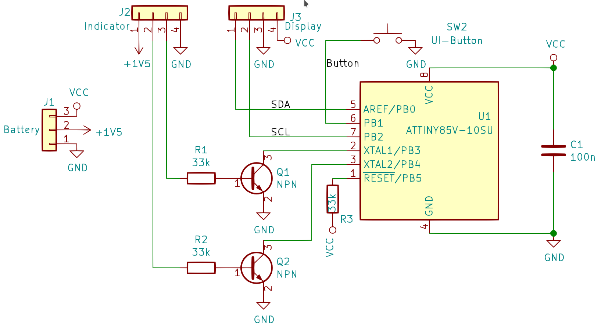
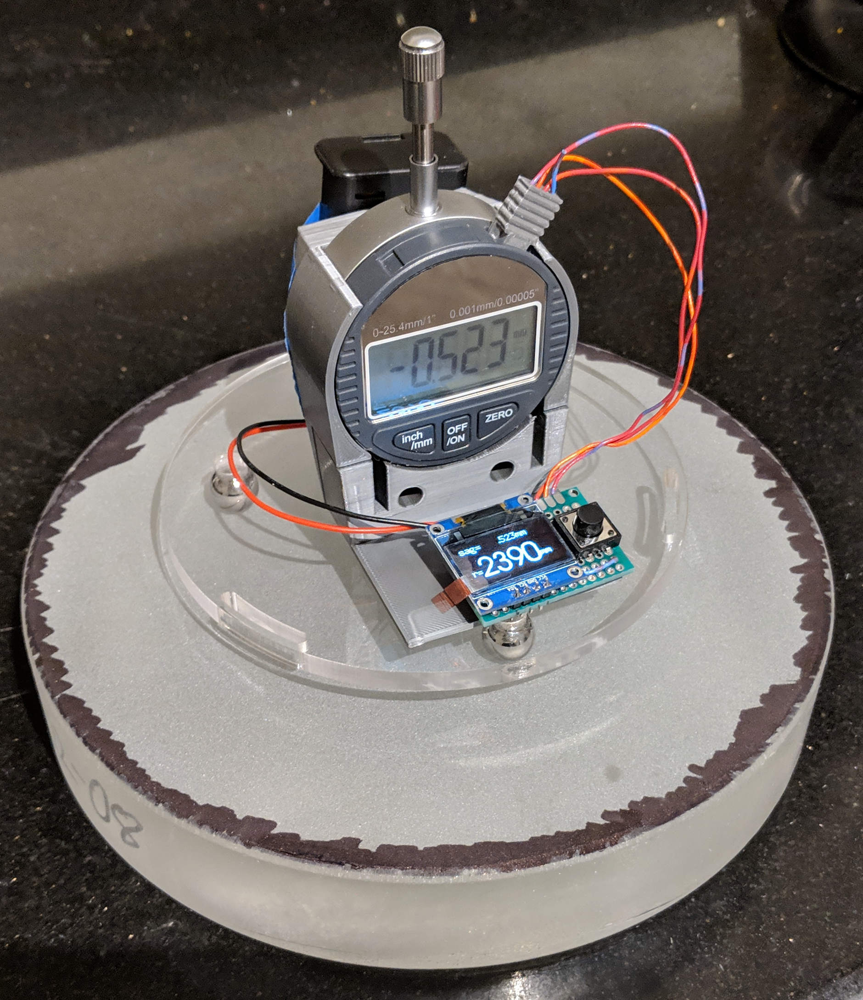

A Digital Spherometer
=====================

Converting the sagittal measurement (SAG) from a dial indicator and converting
in your head to a sphere radius is a pain.

This project uses a microcontroller to make this more pleasent: it reads out
the digital indicator and converts the reading to a sphere radius value
printed on an OLED display. It also adds some other nifty features, such as
converting this into the ƒ/N for your mirror size. See [firmware]-page for
feature details.

The microcontroller is an [ATTiny85], the display is a 0.96" [SSD1306], or
1.3" [SH1106] compatible 128x64 OLED display with I²C interface.
The dial indicator is an generic [autoutlet-indicator] (very cheap in a
get-what-you-pay-for sense: It shows 1μm resolution, but the documentation does
not mention any error range...)

The SPC connector to experiment with the indicator is 3D printed; the [EspDRO]
project has a [design for the plug] which works very well. For 'production'-use,
soldering in the cables makes more sense (but requires opening the indicator).

The [frame](./frame) to hold the dial indicator, microcontroller+display and
batteries is 3D-printed, the base can be laser-cut or machined from some metal
plate.

Firmware                           | Hardware
--------------------------------------|-------------------------------
 | 

#### First prototype with rough mounting frame outline

[attiny85]: https://www.microchip.com/wwwproducts/en/ATtiny85
[ssd1306]: https://www.ebay.com/sch/i.html?_nkw=ssd1306+i2c+128x64
[sh1106]: https://www.ebay.com/sch/i.html?_nkw=sh1106+i2c+128x64
[autoutlet-indicator]: https://www.amazon.com/gp/product/B07C63VFN3
[EspDRO]: https://github.com/MGX3D/EspDRO
[design for the plug]: https://github.com/MGX3D/EspDRO/blob/master/CAD/spc_connector.scad
[avr-gcc]: https://gcc.gnu.org/wiki/avr-gcc
[firmware]: ./firmware