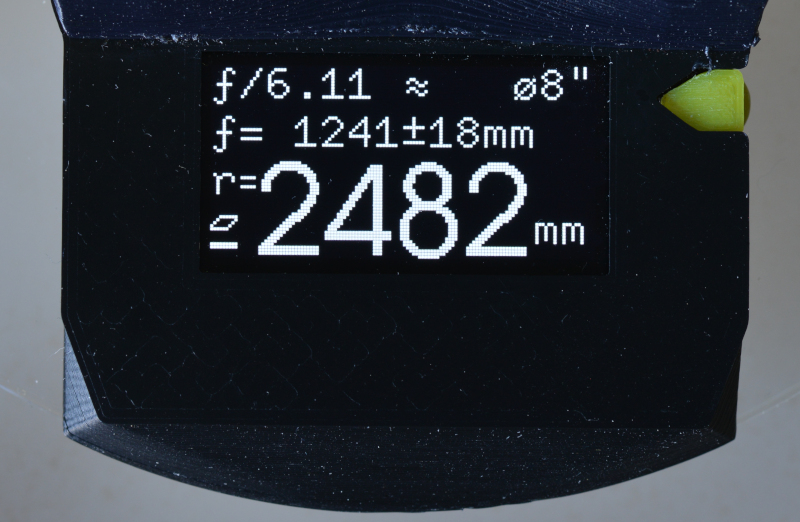
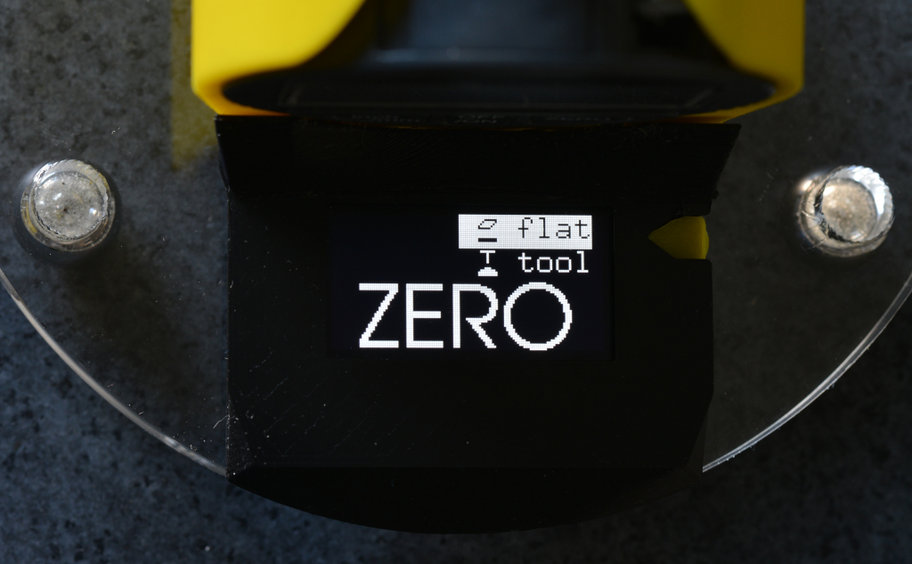
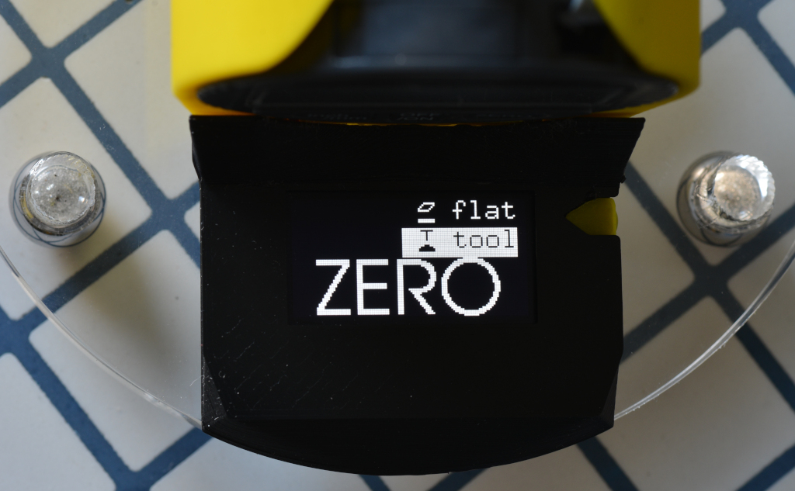
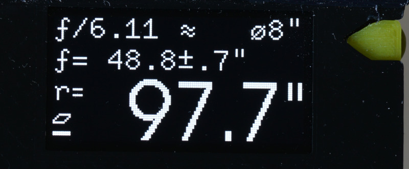

A Digital Spherometer
=====================

Converting the sagittal measurement (SAG) from a dial indicator and converting
in your head to a sphere radius is a pain.

This project uses a microcontroller to make this more pleasent: it reads out
the digital indicator and converts the reading to a sphere radius value
printed on an OLED display. It also adds some other nifty features, such as
converting this into the ƒ/N for your mirror size. See [firmware]-page for
feature details.

The microcontroller is an [ATTiny85], the display is a 0.96" [SSD1306], or
1.3" [SH1106] compatible 128x64 OLED display with I²C interface.

Supported dial indicators are [Mitutoyo 543] (good, industry-standard quality)
and a generic [autoutlet-indicator] (relatively cheap, has 1μm resolution but
no documented accuracy figures. Sells under many different names).

The [case](./frame) to hold the dial indicator, microcontroller+display and
batteries is 3D-printed, the base can be laser-cut or machined from some metal
plate.

### Quicklinks

Case | Electronics | Firmware | Calibration
-----|-------------|----------|-------------
 |  |  | 

### User Manual

Like any Spherometer, we first need to zero the device on a reference surface.
Typically this is done on a flat surface plate, so this spherometer allows for
that: place it on a flat surface and set the dial indicator to zero.

Unlike other spherometers, this device also allows for another (experimental)
mode: using the grinding tool as a reference surface. The convex shaped tool
has the same (but inverted) curvature as the mirror, so this can be used
as a reference, if the tool and mirror are already sufficiently mated. The
spherometer then can do the math to derive the value from that.

To use that mode, place the spherometer on the tool (make sure the balls and
indicator rest on the tiles not hitting a seam), and zero the dial indicator.
The arrow-shaped button the right side of the display allows to toggle between
the reference mode. The selected mode is highlighted.

Reference on Surface Plate         | Reference on Tool               |
-----------------------------------|---------------------------------|
  | 

The tool reference is probably a bit less accurate, but it does not require
you to be in posession of a flat surface plate.

After the device is zeroed, place it on the mirror. It now shows all relevant
values on one screen. This is what you see from top to bottom:

 * The ƒ/N value for a given mirror size. The mirror size (chosen here: `⌀8"`)
   can be cycled through from a list with the arrow-button.
 * The focal length including error margins derived from dial-indicator error
   and spherometer leg-radius error.
 * The radius is shown in a large font

On the bottom left you see a symbol indicating which reference surface this
was against. There are two symbols indicating flat surface and tool referenced
(same symbols as used in the zero screen).

Millimeter | Inch |
-----------|------|
 | 

So in this example we see in one screen, that this is a mirror with a radius
of about 2482mm, a focal length of 1241mm which is ƒ/6.11 for this
8" mirror. The reference surface was a flat surface plate.

Switching between metric and inch on the dial indicator automatically
switches the calculated values to the corresponding units.

The device does not need an additional power button: it auto-detects
when the drop-indicator is switched off and goes to sleep.

[attiny85]: https://www.microchip.com/wwwproducts/en/ATtiny85
[ssd1306]: https://www.ebay.com/sch/i.html?_nkw=ssd1306+i2c+128x64
[sh1106]: https://www.ebay.com/sch/i.html?_nkw=sh1106+i2c+128x64
[Mitutoyo 543]: https://www.mitutoyo.com/products/small-tool-instruments-and-data-management/indicators/digimatic-indicators/absolute-digimatic-indicator-id-s/
[autoutlet-indicator]: https://www.amazon.com/gp/product/B07C63VFN3
[avr-gcc]: https://gcc.gnu.org/wiki/avr-gcc
[firmware]: ./firmware/README.md
