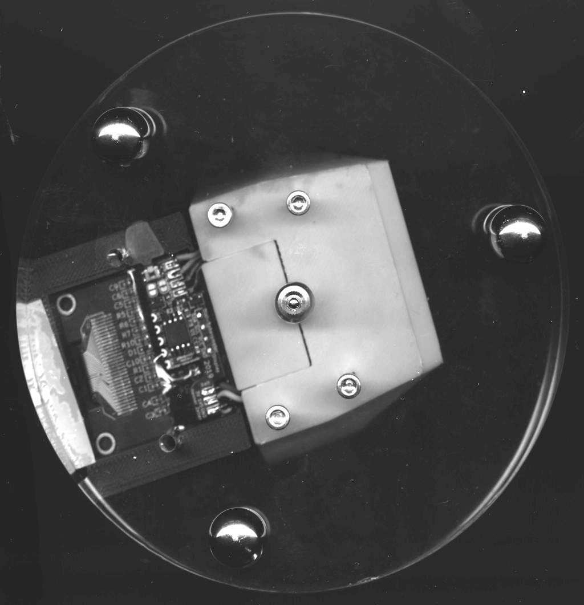

A Digital Spherometer
=====================

Converting the sagittal measurement (SAG) from a dial indicator and converting
in your head to a sphere radius is a pain.

This project uses a microcontroller to make this more pleasent: it reads out
the digital indicator and converts the reading to a sphere radius value
printed on an OLED display. It also adds some other nifty features, such as
converting this into the ƒ/N for your mirror size. See [firmware]-page for
feature details.

The microcontroller is an [ATTiny85], the display is a 0.96" [SSD1306], or
1.3" [SH1106] compatible 128x64 OLED display with I²C interface.

Supported dial indicators are [Mitutoyo 543] (good, industry-standard quality)
and a generic [autoutlet-indicator] (relatively cheap, has 1μm resolution but
no documented accuracy figures. Sells under many different names).

The [case](./frame) to hold the dial indicator, microcontroller+display and
batteries is 3D-printed, the base can be laser-cut or machined from some metal
plate.

Case | Electronics | Firmware | Calibration
-----|-------------|----------|-------------
 |  |  | 

[attiny85]: https://www.microchip.com/wwwproducts/en/ATtiny85
[ssd1306]: https://www.ebay.com/sch/i.html?_nkw=ssd1306+i2c+128x64
[sh1106]: https://www.ebay.com/sch/i.html?_nkw=sh1106+i2c+128x64
[Mitutoyo 543]: https://ecatalog.mitutoyo.com/ABSOLUTE-Digimatic-Indicator-ID-S-Series-543-with-Simple-Design-C1196.aspx
[autoutlet-indicator]: https://www.amazon.com/gp/product/B07C63VFN3
[avr-gcc]: https://gcc.gnu.org/wiki/avr-gcc
[firmware]: ./firmware/README.md