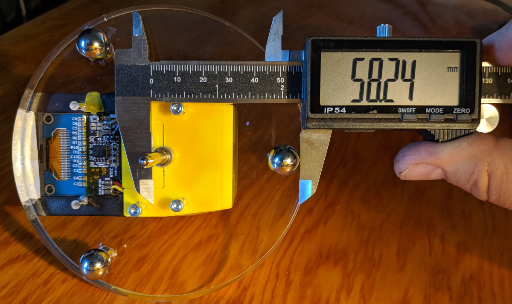
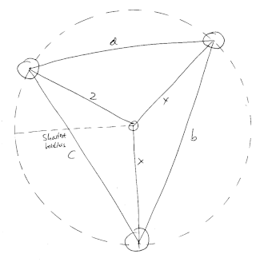

Calibration
==========

Any mechanical system build to dimensions will be slightly off from the desired
dimensions.  These inaccuracies might be small (if a CNC machine was used) or
larger if built by hand. If we measure the final outcome, we can correct for
that as we can feed back the measured dimensions into the firmware.

The dimension that is critical for correct measurements it the distance
of the dial indicator tip to the edge of the circle spanned by the three
balls on the base-plate. Note: in many articles about spherometer
calibration, you only see calculations of the radius of circle spanned
by the legs. But given that the indicator stem might be off-center, the really
interesting value is the closest distance from that stem to the leg-circle.

Once we have measured that radius, we can update the firmware using the radius
we measure.

Let's discuss three options.

# 1. Simple measurement

In the simplest case, we just measure the distance between the ball and the
stem of the indicator. We measure from the outside of the ball to the opposing
side of the stem. We get the radius by substracting the radius of the balls
(here: diameter 12.7mm) and the radius of the stem (here: diameter 4.5mm),
that we measure separately. So the radius in this example is
**58.24mm - 12.7mm/2 - 4.5mm/2 = 49.64mm**



We do this for all legs and simply use the smallest value. This is only an
approximation as the off-center direction might not be in-line with one
of the measurements, but probably fairly accurate.

# 2. Comprehensive measurement

Here, we would measure the distance between each ball and calculate the radius
of the equivalent circle. Then we measure the distance from each ball to the
center. From there, we can work out exactly the relative position of the stem
to the legs and determine the closest position of the stem to the edge of the
leg-circle. Math left as an exercise for the reader.



# 3. Optical measurement

For this different kind of comprehensive measurement, we'll use an optical
tool: a flatbed scanner. It has a pretty accurate fixed pixel-to-realworld
size translation which allows us to determine accurate absolute measurements.
This can give us in the order of 1/100mm accurate measurements ... if the
points to measure provide a high-contrast point, which is unfortunately not
true with the steel balls.

## Scanning

Put your final spherometer on the bed and create a high-resolution scan
(>= 600dpi). Be aware that the resulting images are _very_ large, so make sure
to select only the relevant part in the preview.


It might be a little hard later to find the exact center where the ball hits
the surface. Maybe experimenting putting the balls in a little puddle of ink
might be a good idea. In my case, the center of the balls were ever so slightly
scratched where they were touching a surface bfore, so it was fairly simple
to see the center.

## Measuring

Load the image into your favorite image editing program (I use [gimp]), and
zoom into the relevant parts and hover the mouse-cursor right where you see
the center of the ball. Write down the coordinate where that is (in gimp, it
shows in the status line at the bottom).

Do this for all three balls, then the center and write these coordinates
to a file. These coordinates can be quite large numbers as the scan has a
pretty high resolution.

All coordinates are written to a text-file; here are the are numbers for my
spherometer scanned with 2400dpi, written to a textfile `positions.txt`.

```
6385  9605
14629 9845
10731 2616
10590 7313
```

## Calculating scan results

Now, we want to convert these values to something useful to plug into our
firmware.

For that, there is a little program in this directory you can use. Build it:

```
make
```

Now, we can use the resulting `spscan` program. We just give it the coordinates
from above on stdin, and also tell the program that the resolution was in
2400dpi:


```
./spscan 2400 < positions.txt
Circle radius...............: 50.289mm
Indicator to true center....:  0.573mm
Effective Spherometer radius: 49.716mm
```

Done. Maybe you want to re-do the measurements a couple of times with different
rotations on the scanner to even out slight aspect-ratio and reading issues.
Take an average of that effective spherometer radius measurement.

# Firmware update

Using one of the methods above, we now have a radius that is closer to reality.
Now we can build the firmware with the calculated value for more accurate
readings:

```
cd ../firmware
make USER_DEFINES=-DSPHEROMETER_RADIUS_MM=49.906
```

See the [firmware-page](../firmware) for building and flashing instructions.

[gimp]: https://www.gimp.org/
