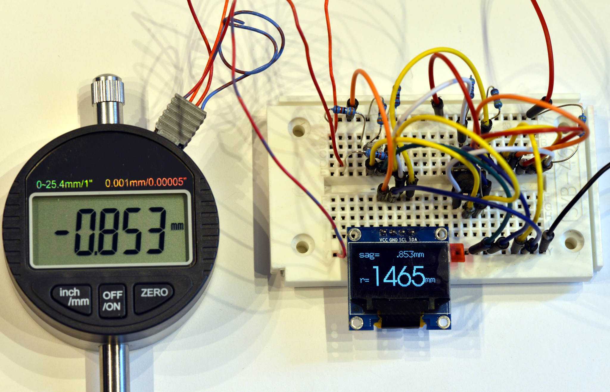

Firmware Digi-Spherometer
=========================

The Firmware runs on an [ATTiny85]. The digital drop meter is connected to two
IO-pins, the [SSD1306 screen]/[SH1106 screen] is controlled via I²C.

See the [electronic](../pcb) section about the wiring.

### Features
Switching the drop-meter between metric and inch automatically switches the
screen to the corresponding units, including the calculated values.

The main screen shows the current drop-meter radius in a large,
easy-to-read font. A Button press allows to switch to a second screen that
shows the calculated focal length of the (spherical) mirror and ƒ/N-values
calucated for various mirror sizes.

The device does not need an additional power button: it auto-detects
when the drop-indicator is switched off (because it stops sending updates), and
then goes to deep sleep; waking up when the indicator is switched on again.
The ATTiny only consumes < 0.8μA current when in deep sleep - easily
outlasting the lifetime of the AA batteries many times ...

### Display and Font Handling
The ATTiny85 RAM is small (512 Byte), which does not allow for having a
frame-buffer for the 128x64 display (1KiB) in memory as many implementations do.
The fonts are compiled-in and directly copied from `PROGMEM`-memory.

The I²C and OLED display code is freshly implemented with only the relevant
features. The display-code only uses features from the SH1106 controller, so it
is compatible with SH1106 and SSD1306. You still need a compile-time option
to distinguish the displays as there is a different pixel-offset.

The fonts were [generated as C-Arrays][bdfont.data] from some BDF
fonts so that they can be compiled into the binary.
Fonts can be 'sparse' and only contain characters really needed in the
application; this is necessary as flash-memory in the ATTiny is pretty limited
with 8KiB.

Given that the font is sparse anyway, thus we're not forced to include all
characters, this implementation allows for any character in the 16 bit [Plane 0]
range of Unicode characters.
With that, the UI can easily include special non-ASCII characters, such
as `ƒ`, `μ` or `±`. The `Print()` function accepts
text-literals as UTF-8 strings, which makes them very natural to use while
keeping the code compact.

Anyway, the tool to generate the font-data and support functions to emit these
became its [own little project][bdfont.data] - check
it out if you regularly have to get bitmapped fonts into small devices.

### Code choices
Even though binary space is limited, `float`-numbers are used for the
calculations; it simplifies code in comparsion to fixed-point integer
calculations as there are large differences in orders of magnitude. Given that
we have enough space, the readability of the code was more important.

### Install
To build, install the `avr-gcc` toolchain and `avrdude`. There is no
boot-loader, we directly program the chip with an AVR-compatible programmer
through the SPI in-circuit programming pins of the ATTiny85.

The first time the chip is programmed, make sure to set the fuses:
```bash
make fuse
```

Then, compiling and pushing new code to the ATTiny is as simple as invoking
`make flash`. There are some defines that you can pass directly on the
command-line, see [Makefile](./Makefile).

```bash
make USER_DEFINES="-DDISPLAY_I2C=0x78 -DINDICATOR_DECIMALS=3" flash
```



[attiny85]: https://www.microchip.com/wwwproducts/en/ATtiny85
[ssd1306 screen]: https://www.ebay.com/sch/i.html?_nkw=ssd1306+i2c+128x64
[sh1106 screen]: https://www.ebay.com/sch/i.html?_nkw=sh1106+i2c+128x64
[Plane 0]: https://en.wikipedia.org/wiki/Plane_(Unicode)#Basic_Multilingual_Plane
[bdfont.data]: https://github.com/hzeller/bdfont.data