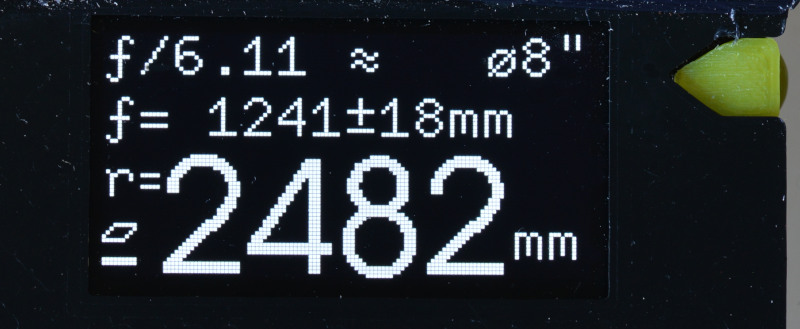

Firmware Digi-Spherometer
=========================

The Firmware runs on an [ATTiny85]. The digital drop meter is connected to two
IO-pins, the [SSD1306 screen]/[SH1106 screen] is controlled via I²C.

See the [electronic](../pcb) section about the wiring.

### Features
Switching the drop-meter between metric and inch automatically switches the
screen to the corresponding units, including the calculated values.

The screen shows the current mirror-radius in a large font.
In addition, the focal length of the mirror (which is 1/2 the radius)
and the ƒ/N-value for a selected aperture.
A Button press allows to choose between different common mirror-diameters
(compile-time choice).

The focal length is shown with error-margins, which are determined by the
error introduced by the limited accuracy of the dial indicator as well as
mechanical unknowns of the spherometer radius.



(TODO: explain experimental tool reference feature)

The device does not need an additional power button: it auto-detects
when the drop-indicator is switched off (because it stops sending updates), and
then goes to deep sleep; waking up when the indicator is switched on again.
The ATTiny only consumes < 0.8μA current when in deep sleep - easily
outlasting the lifetime of the AA batteries many times ...

### Display and Font Handling
The ATTiny85 RAM is small (512 Byte), which does not allow for having a
frame-buffer for the 128x64 display (1KiB) in memory as many implementations do.
The fonts are compiled-in and directly copied from `PROGMEM`-memory.

The I²C and OLED display code is freshly implemented with only the relevant
features. The display-code only uses features from the SH1106 controller, so it
is compatible with SH1106 and SSD1306 (you still need a compile-time option
to distinguish the displays as there is a different pixel-offset).

The fonts were [generated as C-Arrays][bdfont.data] from bitmap BDF
fonts so that they can be compiled into the binary.
Fonts can be 'sparse' and only contain characters really needed in the
application; this is necessary as flash-memory in the ATTiny is pretty limited
with 8KiB. The [bdfont.data] project provides [Plane 0] UTF8 support, which makes
it easy to include special characters such as `ƒ`, `μ` or` ⚠`;
it is a separate project, check it out if you need font-support in your small
devices.

### Code choices
Even though binary space is limited, `float`-numbers are used for the
calculations; it simplifies code in comparsion to fixed-point integer
calculations (in particular as there are large differences in orders of
magnitude).
Given that we have enough code space, the readability of the code was more
important.

### Install
To build, install the `avr-gcc` toolchain and `avrdude`. There is no
boot-loader, we directly program the chip with an AVR-compatible programmer
through the SPI in-circuit programming pins of the ATTiny85.

The first time the chip is programmed, make sure to set the fuses:
```bash
make fuse
```

Then, compiling and pushing new code to the ATTiny is as simple as invoking
`make flash`. There are some defines that you can pass directly on the
command-line, see [Makefile](./Makefile). In particular after
[calibration](../calibration), you might want to define the exact measured
spherometer radius.

```bash
make USER_DEFINES="-DDISPLAY_I2C=0x78 -DINDICATOR_DECIMALS=3 -DSPHEROMETER_RADIUS_MM=50.0" flash
```

The default compile works with the Autoutlet dial indicator. If you use a
Mitutoyo indicator, add `-DINDICATOR_MITUTOYO` to your `USER_DEFINES`.


[attiny85]: https://www.microchip.com/wwwproducts/en/ATtiny85
[ssd1306 screen]: https://www.ebay.com/sch/i.html?_nkw=ssd1306+i2c+128x64
[sh1106 screen]: https://www.ebay.com/sch/i.html?_nkw=sh1106+i2c+128x64
[Plane 0]: https://en.wikipedia.org/wiki/Plane_(Unicode)#Basic_Multilingual_Plane
[bdfont.data]: https://github.com/hzeller/bdfont.data