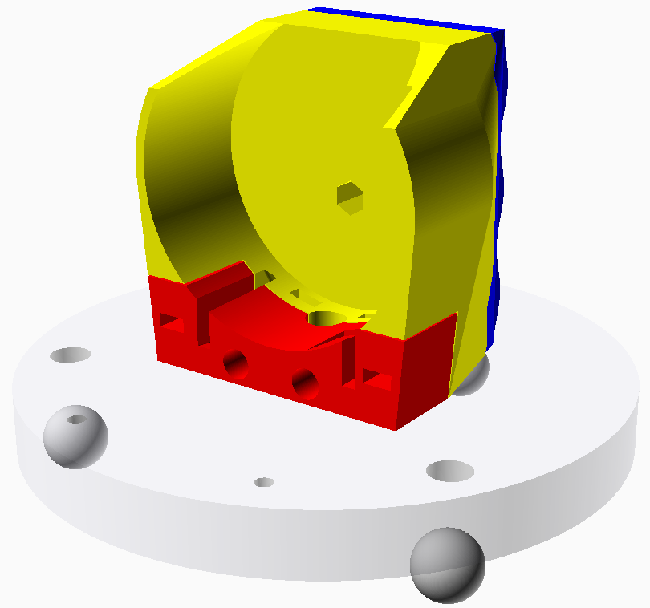

Case for the Spherometer
========================

These are generated with OpenSCAD.

To generate, OpenSCAD needs to be installed, then just run

```
make -j6
```

which produces all the relevant fabrication files in the `fab/` sub-directory

```
make
$ ls fab/
display_case_button.stl
display_front_part.stl
display_transition_part.stl
leg_plate_2d.dxf
spherometer_frame_battery_lid.stl
spherometer_frame_main_block.stl
spherometer_frame_stem_squeeze_block.stl
```

All 3D printed parts are emitted as STL, the shape of the base-plate as DXF.

Cut the base-plate, e.g. using a laser cutter from acrylic (I used 12mm thick
one), or use it as guidance to machine a base-plate from metal.

Place the STL parts flat on your build-plate using the features of your slicer.
The main-block best prints upright, you might only need a little support on
the overhanging arch on top when printing with ABS (PLA might be fine).
The overhang inside the battery box is fine without support, even with ABS.
Use specific supports, not autogenerated supports as they tend to clog-up the
screw-holes.

Display case is best printed upside down to have a nice flat front-surface. The
display transition part is separate and can be glued to it later.

All screws are M3.



