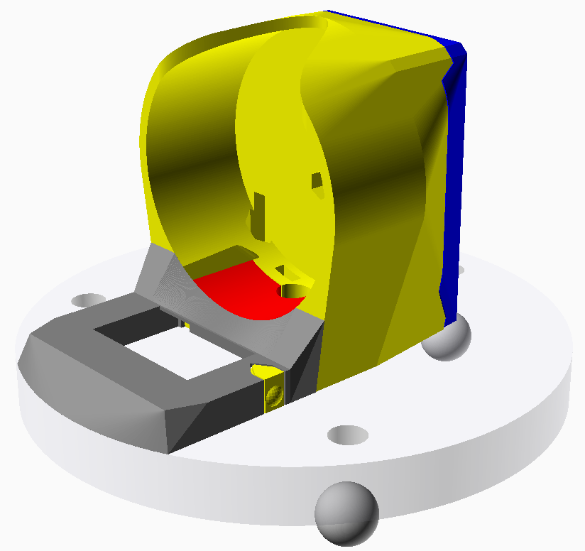

Case for the Spherometer
========================

These are generated with OpenSCAD.

To generate, OpenSCAD needs to be installed, then just run

```
make
```

which produces all the relevant fabrication files.



