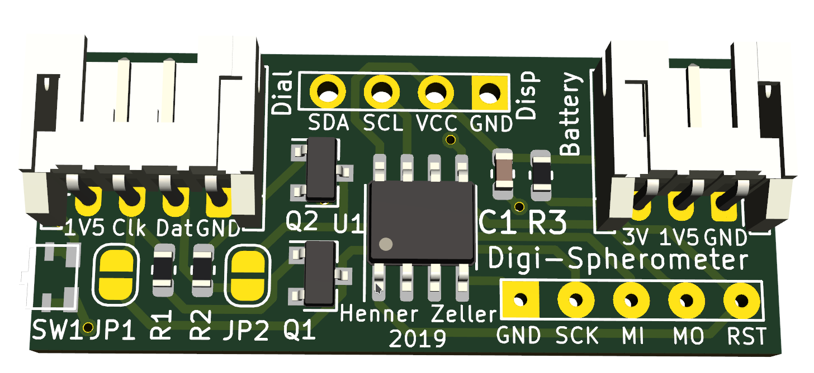
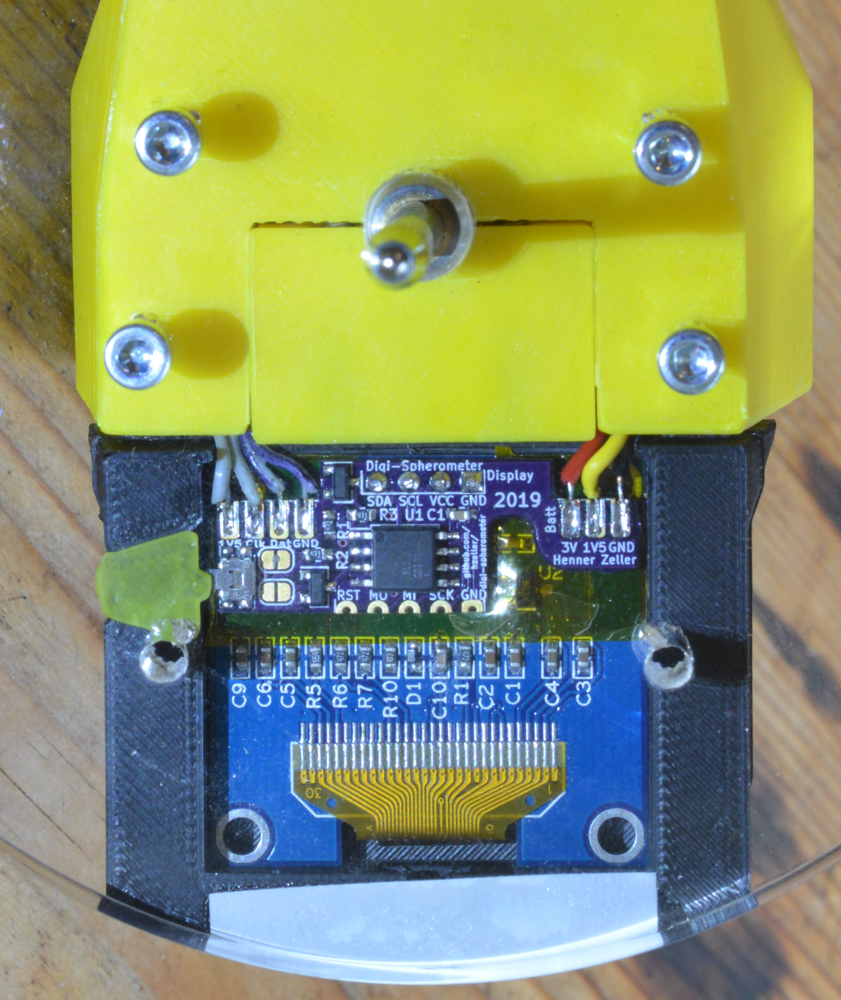

Electronics
===========

Schematic is pretty straightforward, mostly things are wired up directly
to the Attiny85. Level conversion of the 1.5V signals from the indicator is
done with some generic NPN transistors.

Some dial indicators, such as Mitutoyo, already have an open collector output,
in that case, the jumpers allow to directly connect the device. The
`R1`, `R2`, `Q1`, `Q2` components need not be populated in that case.

There are two slot connectors on the board, on one side to connect the indicator
(GND, CLK and DATA and optional 1.5V), the other to connect the battery. The
placement is in accordance with the 3D-printed cases.
The connectors are slots to allow for a convenient, low-profile soldering of
wires to it (wires vanish completely inside the slots).
At the top there is some space for easier wire-management (see picture below).

Some indicators (such as the autoutlet) can be powered from an external 1.5V
source; if the battery-pack is tapped in the middle, this is passed through.
Do not use at this point, leave the 1.5V slots disconnected: turns out that the
long battery wire and the connection to the μC injects too much noise. Might
need some filtering.

The board is designed with cut-outs to stay clear of components on the
particular display module I was using to place the board with no gap on the
module; YMMV.

### BOM

Count  | Part                     | Footprint          | Designators  | Remarks
-------|--------------------------|--------------------|--------------|---------
1      | Attiny85V-10             | SOIC-8 5.3mm wide  | U1           |
1      | Capacitor 100n           | 0603 (1608 Metric) | C1           |
3      | Resistor 47k             | 0603 (1608 Metric) | R1, R2, R3   |
2      | MMBTA06LT1HTSA1          | SOT23              | Q1, Q2       | Any SOT23 NPN will do
1      | Panasonic EVQ-P7L01P     | (custom)           | SW1          |
1      | SH1106 Display (i2c)     | (custom)           | Disp         |

Then of course a 1.3" SH1106 module with I²C interface. Make sure the pins
come in sequence `SDA`, `SCL`, `VCC`, `GND` if looked from the back.

### Schematic

### PCB
This board is soldered to the back of a 1.3" OLED display

Also [shared here on OshPark](https://oshpark.com/projects/MvLMlrob); to keep
things thin, order with 0.8mm thickness.

### View through acrylic bottom

