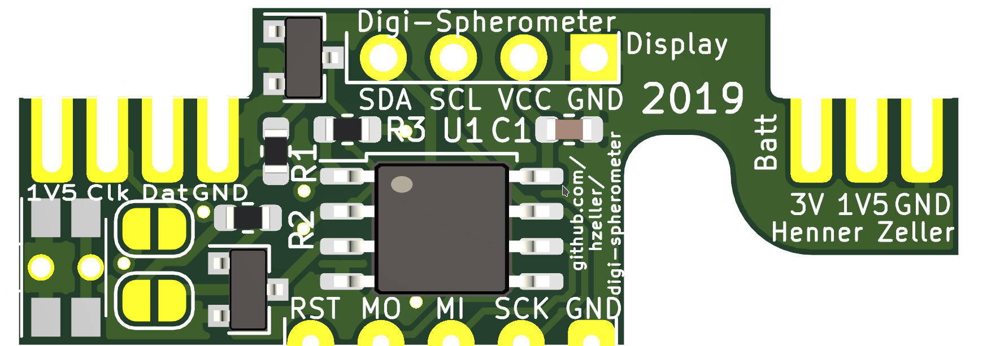

Electronics
===========

Schematic is pretty straightforward, mostly things are wired up directly
to the Attiny85. Level conversion of the 1.5V signals from the indicator is
done with some generic NPN transistors.

Some dial indicators, such as Mitutoyo, already have an open collector output,
in that case, the jumpers allow to directly connect the device. The
`R1`, `R2`, `Q1`, `Q2` components need not be populated in that case.

### Schematic

### PCB
This board is soldered to the back of a 1.3" OLED display

### as prototype
