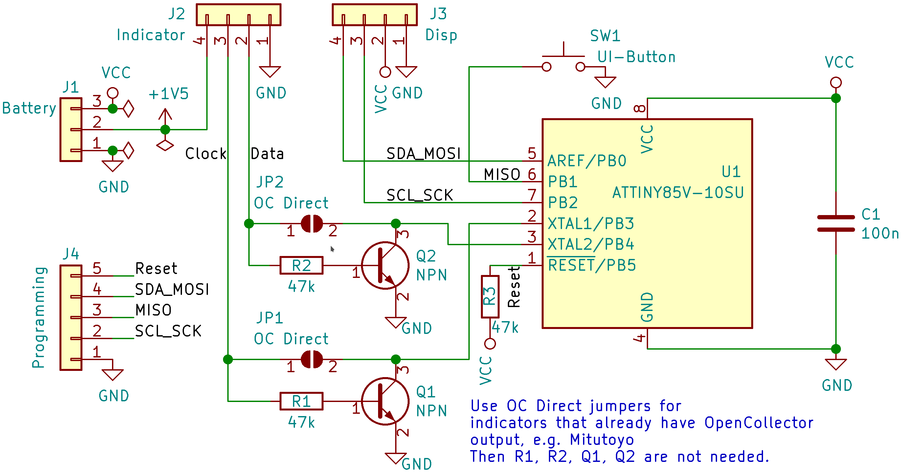
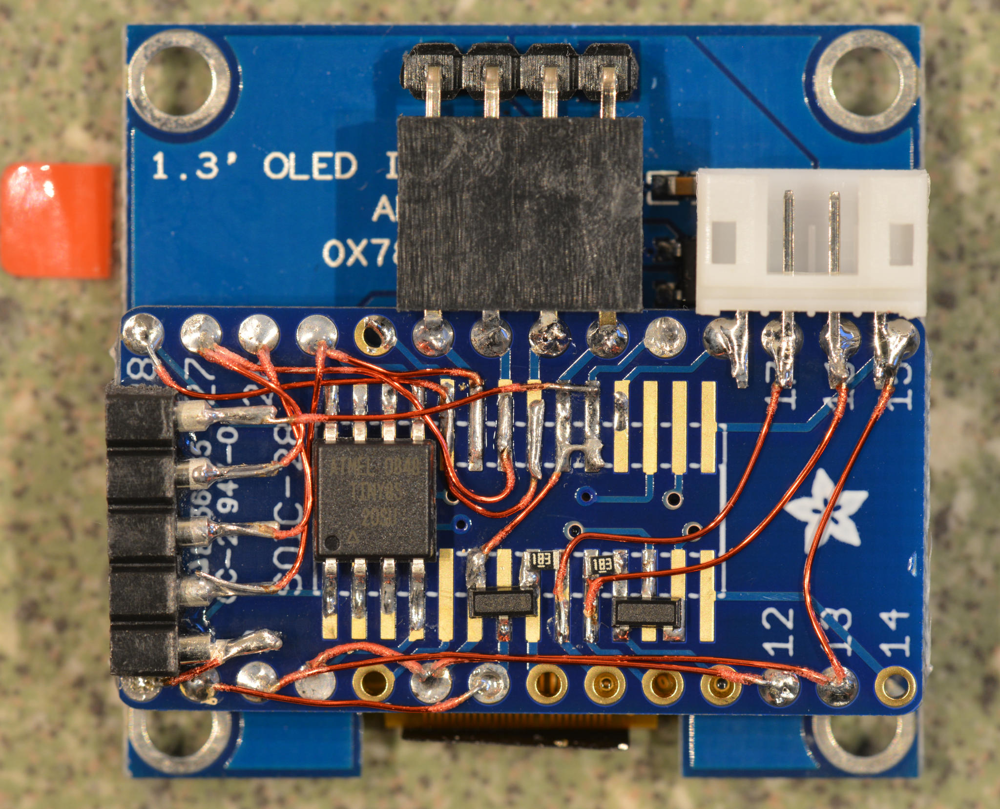

Electronics
===========

Schematic is pretty straightforward, mostly things are wired up directly
to the Attiny85. Level conversion of the 1.5V signals from the indicator is
done with some generic NPN transistors.

### Schematic

### The first prototype board
